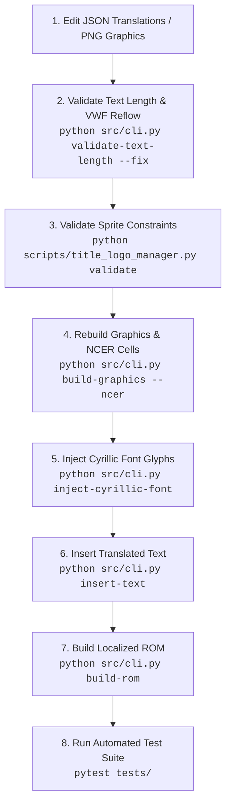

# Chrono Trigger DS (CTDS) Translation Pipeline

Project-specific workspace skill for translating, reverse engineering, and rebuilding **Chrono Trigger DS (Europe) (En,Fr)**.

---

## 1. CLI Commands Reference (`src/cli.py`)

All pipeline operations are executed via `python src/cli.py <command> [options]`.

### 1.1. Graphics Pipeline (`build-graphics`, `dump-graphics`)

#### `build-graphics` (alias: `insert-graphics`)
Rebuilds background screens (`_ncg.bin`, `_ncl.bin`, `_nsc.bin`) or sprite sheets (`.NCGR`, `.NCER`) from PNG images and JSON metadata into the extracted ROM directory.

```powershell
# Single screen rebuild:
python src/cli.py build-graphics --screen "translated image/title/bg/kenri.png"

# Single sprite rebuild with NCER cell bank regeneration:
python src/cli.py build-graphics --screen "translated image/title/obj/obj_logo_new.png" --ncer

# Batch rebuild a specific subdirectory (e.g. menu):
python src/cli.py build-graphics --dir "menu"

# Batch rebuild with NCER cell bank regeneration across directory:
python src/cli.py build-graphics --dir "title/obj" --ncer

# Batch rebuild all translated graphics:
python src/cli.py build-graphics --image-dir "translated image" --meta-dir "extracted image" --rom-data "extracted rom/data"
```

| Flag | Default | Description |
| :--- | :--- | :--- |
| `--screen` | `None` | Path to a specific PNG file to rebuild (single mode). |
| `--ncer` | `False` | Rebuild corresponding `.NCER` cell bank binaries when rebuilding cell sheet sprites. |
| `--dir`, `--directory` | `None` | Subdirectory within `image-dir` to rebuild in batch (e.g. `menu`, `title/obj`). |
| `--image-dir` | `translated image` | Source directory containing modified PNG graphics. |
| `--meta-dir` | `extracted image` | Directory containing layout metadata JSON descriptors. |
| `--rom-data` | `extracted rom/data` | Destination NitroFS data directory. |

#### `dump-graphics`
Extracts raw ROM graphics into editable PNG images and JSON layout descriptors.

```powershell
# Dump a single screen:
python src/cli.py dump-graphics --screen "extracted rom/data/title/bg/kenri"

# Dump a single NCGR sprite with cell bank and palette:
python src/cli.py dump-graphics --screen "extracted rom/data/title/obj/obj_logo_new.NCGR" --ncer "extracted rom/data/title/obj/obj_logo_new.NCER" --palette "extracted rom/data/title/obj/obj_logo_new.NCLR"

# Dump a specific subdirectory:
python src/cli.py dump-graphics --dir "menu"

# Dump all graphics (screens, slides, sprites) across entire ROM:
python src/cli.py dump-graphics --all
```

| Flag | Default | Description |
| :--- | :--- | :--- |
| `--screen` | `None` | Path or stem of a specific screen/sprite to dump. |
| `--palette`, `--nclr` | `None` | Explicit path to `.NCLR` or `.ncl.bin` palette file. |
| `--ncer` | `None` | Explicit path to `.NCER` cell bank file. |
| `--dir`, `--directory` | `None` | Subdirectory in `rom-data` to dump (e.g. `menu`, `title/bg`). |
| `--all` | `False` | Dump all screens, slides, and sprites across the entire ROM. |
| `--rom-data` | `extracted rom/data` | Source NitroFS data directory. |
| `--out` | `extracted image` | Output directory for PNGs and JSON descriptors. |

---

### 1.2. Text Validation & VWF Formatting (`validate-text-length`)

#### `validate-text-length` (alias: `validate-text-lenght`)
Calculates pixel widths using proportional Variable Width Font (VWF) metrics, checks dialogue page limits, and automatically wraps/reflows text.

```powershell
# Dry-run validation of a single file:
python src/cli.py validate-text-length --file "translated text/menu.json"

# Auto-fix line breaks and reflow dialogue across an entire folder:
python src/cli.py validate-text-length --json-dir "translated text" --fix

# Auto-fix a single dialogue file with page splitting:
python src/cli.py validate-text-length --file "translated text/msg01.json" --fix --paginate

# Validate with explicit preset override:
python src/cli.py validate-text-length --file "translated text/custom.json" --preset tutorial

# Validate with custom width and line limits:
python src/cli.py validate-text-length --file "translated text/shop.json" --max-width 160 --max-lines 2 --fix
```

| Flag | Default | Description |
| :--- | :--- | :--- |
| `--file`, `--json-file` | `None` | Path to a single JSON translation file (overrides `--json-dir`). |
| `--json-dir` | `translated text` | Directory containing JSON translation files. |
| `--preset` | `auto` | Window preset (`auto` selects preset based on filename pattern). |
| `--fix` | `False` | Apply wrapping/reflow fixes and write back to JSON files. |
| `--out` | `None` | Optional output directory to write fixed files without overwriting source. |
| `--max-width` | `None` (preset) | Maximum line width in pixels (overrides preset default). |
| `--max-lines` | `None` (preset) | Maximum lines per dialogue box page (overrides preset default). |
| `--paginate` | `False` | Automatically split pages with `{PAGE}` when lines exceed `max-lines`. |
| `--no-reflow` | `None` (preset) | Disable collapsing existing line breaks before re-wrapping. |
| `--font-json` | `extracted fonts/msg/big/msgcmn.json` | Path to base font metrics JSON. |
| `--cyrillic-json` | `assets/fonts/cyrillic_big.json` | Path to Cyrillic font metrics JSON. |
| `--field` | `translation` | JSON field key to validate and wrap. |

---

### 1.3. Font Management (`build-font`, `dump-font`, `inject-cyrillic-font`)

```powershell
# Dump all .fnt binary fonts to PNG glyph sheets + JSON metrics:
python src/cli.py dump-font --rom-data "extracted rom/data" --out "extracted fonts" --grid both

# Rebuild all .fnt binary fonts from PNG sheets + JSON metrics:
python src/cli.py build-font --font-dir "extracted fonts" --rom-data "extracted rom/data"

# Inject 66 Cyrillic glyphs (А..Я, а..я, Ё, ё) into font files in ROM data:
python src/cli.py inject-cyrillic-font --rom-data "extracted rom/data" --assets-dir "assets/fonts"
```

| Command | Key Flags | Description |
| :--- | :--- | :--- |
| `dump-font` | `--grid both\|cells\|none` | Generates editable font PNGs with visual tile/VWF width boundaries. |
| `build-font` | `--font-dir`, `--rom-data` | Rebuilds proprietary 2bpp `.fnt` font binaries. |
| `inject-cyrillic-font` | `--font`, `--assets-dir` | Injects pixel-art Cyrillic glyphs into all ROM `.fnt` files (`base >= 450`). |

---

### 1.4. ROM Lifecycle & Verification (`unpack`, `dump-text`, `insert-text`, `build-rom`, `roundtrip`)

```powershell
# 1. Unpack original NDS ROM:
python src/cli.py unpack --nds "rom/Chrono Trigger (Europe) (En,Fr).nds" --out "extracted rom"

# 2. Dump all text messages to JSON:
python src/cli.py dump-text --rom-data "extracted rom/data" --out "extracted text"

# 3. Insert translated JSON text back to ROM:
python src/cli.py insert-text --json-dir "translated text" --rom-data "extracted rom/data"

# 4. Rebuild localized NDS ROM preserving clean header/timings:
python src/cli.py build-rom --extracted "extracted rom" --base "rom/Chrono Trigger (Europe) (En,Fr).nds" --out "rom/Chrono Trigger (Russian).nds"

# 5. Automated full roundtrip pipeline verification:
python src/cli.py roundtrip --nds "rom/Chrono Trigger (Europe) (En,Fr).nds"
```

---

## 2. Window Presets Reference (17 Presets in `src/text_validator.py`)

`WINDOW_PRESETS` defines line width and page constraints for all dialogue and UI text boxes in the game.

| Preset Name | Max Width (px) | Max Lines | Reflow | Font Type | Target File Patterns |
| :--- | :---: | :---: | :---: | :---: | :--- |
| `dialogue` | **230** | **3** | `True` | `big` | `msg*.json`, `cmes*.json`, `kmes*.json`, `mesi*.json`, `mesk*.json`, `mess*.json`, `mest*.json`, `exms*.json`, `comu*.json`, `ques*.json` |
| `tutorial` | **230** | **6** | `True` | `big` | `tutorial.json`, `start.json`, `ev_title.json` |
| `encyclopedia` | **215** | **6** | `True` | `big` | `player.json`, `ex_mon*.json`, `ex_itemget.json`, `ex_illust.json`, `ex_ending.json` |
| `item_desc` | **195** | **2** | `True` | `big` | `item_mes.json`, `item_mes2.json` |
| `item_sub` | **110** | **2** | `False` | `big` | `item_sub.json` |
| `item_name` | **105** | **1** | `False` | `big` | `item.json`, `ex_item.json` |
| `tech_name` | **80** | **1** | `False` | `big` | `tech.json` |
| `tech_desc` | **190** | **2** | `True` | `big` | `tec_mes.json`, `mon_tec.json` |
| `monster_name` | **85** | **1** | `False` | `big` | `monster.json`, `wireless_mon*.json` |
| `map_location` | **120** | **1** | `False` | `big` | `map.json`, `w_map.json` |
| `bgm_name` | **145** | **1** | `False` | `big` | `bgm.json` |
| `credits` | **180** | **1** | `False` | `big` | `endroll*.json`, `staf.json` |
| `zukan` | **70** | **1** | `False` | `big` | `zukan.json` |
| `battle` | **210** | **2** | `True` | `big` | `battle.json` |
| `menu` | **200** | **2** | `False` | `big` | `menu.json`, `wireless*.json` |
| `system_big` | **200** | **2** | `False` | `big` | `msg/big/system.json`, `big/system.json` |
| `small_system` | **130** | **1** | `False` | `small` | `msg/small/*.json`, `sfc_*.json`, `small.json`, `small/system.json`, `system.json` |

### Specialized Window Layouts & CLI Overrides
When translating specialized dialogs that require specific geometry not bound to a dedicated pattern, apply explicit CLI flags or reference the corresponding window layout:
- **`save_menu`** (190px, 2L, `big`): Save slot info and confirmation prompt (`--max-width 190 --max-lines 2`).
- **`status_menu`** (195px, 2L, `big`): Character status notes and stat descriptions (`--max-width 195 --max-lines 2`).
- **`shop_menu`** (160px, 2L, `big`): Merchant dialogue, buy/sell prompt (`--max-width 160 --max-lines 2`).
- **`options_menu`** (175px, 1L, `big`): Configuration settings descriptions (`--max-width 175 --max-lines 1`).
- **`name_entry`** (150px, 1L, `big`): Character naming banner and labels (`--max-width 150 --max-lines 1`).
- **`epoch_dest`** (140px, 1L, `big`): Era time gauge and destination names (`--max-width 140 --max-lines 1`).
- **`system_prompt`** (200px, 2L, `big`): Modal confirm dialogs ("Are you sure?", etc., `--max-width 200 --max-lines 2`).

---

## 3. Granular Entry Constraints (`menu.json`, `battle.json`, `system.json`)

Composite UI files contain elements of radically different sizes (from 45px buttons to 205px hint bars). Function `get_constraints_for_entry` in `src/text_validator.py` applies granular per-entry constraints:

### 3.1. `menu.json` Granular Constraints

| Entry ID Range | UI Element Description | Sub-Preset Name | Max Width (px) | Max Lines | Reflow |
| :--- | :--- | :--- | :---: | :---: | :---: |
| `0` .. `35` | Short stat labels (`LV`, `HP`, `MP`, `EXP`, `Time`, `G`) | `menu_stat_label` | **70** | 1 | `False` |
| `39` .. `44` | Era / Epoch warp destinations (`12,000 B.C.`, `65,000,000 B.C.`) | `menu_era_dest` | **130** | 1 | `False` |
| `45` .. `56` | Stat parameter labels (`Attack`, `Defense`, `Magic Def`) | `menu_stat_param` | **95** | 1 | `False` |
| `57` .. `60` | Equipment slot labels (`Weapon`, `Helm`, `Armor`, `Accessory`) | `menu_slot_label` | **70** | 1 | `False` |
| `61` .. `67` | Inventory category tabs & sort button (`Items`, `Key Items`, `Sort`) | `menu_item_tab` | **95** | 1 | `False` |
| `69` .. `74` | Empty inventory / equip status messages | `menu_status_msg` | **195** | 1 | `False` |
| `78` .. `83` | Tech category headers (`Single Techs`, `Double Techs`, `Triple Techs`) | `menu_tech_category` | **95** | 1 | `False` |
| `84` | Screen Header (`Settings`) | `menu_header` | **110** | 1 | `False` |
| `85` .. `98` | Option labels (Settings 2-column table on top screen) | `menu_config_option` | **105** | 1 | `False` |
| `99`, `101`..`104` | Action buttons (`Cancel`, `Save & Apply`, `Enable/Disable`, `Accept`) | `menu_action_button` | **65** | 1 | `False` |
| `100` | Defaults button on bottom screen (`[SELECT] Defaults`) | `menu_defaults_button` | **45** | 1 | `False` |
| `109` .. `112` | Settings toggle values (`OFF`, `TYPE A`, `TYPE B`, `Custom`) | `menu_toggle` | **50** | 1 | `False` |
| `113` .. `116` | Settings tab headers (`Battle I`, `Battle II`, `Controls`, `System`) | `menu_tab` | **65** | 1 | `False` |
| `141` | Name entry prompt (multi-line banner) | `menu_naming_prompt` | **230** | 2 | `True` |
| `144` .. `178` | Bottom screen hint / explanation bar | `menu_bottom_hint` | **205** | 1 | `False` |
| `179` .. `181` | Control navigation help lines on bottom screen | `menu_control_help` | **230** | 1 | `False` |
| *All other entries* | General menu items fallback | `menu_general` | **120** | 1 | `False` |

### 3.2. `battle.json` Granular Constraints

| Entry ID Range | UI Element Description | Sub-Preset Name | Max Width (px) | Max Lines | Reflow |
| :--- | :--- | :--- | :---: | :---: | :---: |
| `0` .. `7` | Action commands (`Attack`, `Tech`, `Combo`, `Item`, `Escape`) | `battle_command` | **60** | 1 | `False` |
| `8` .. `23` | Status ailments & buffs (`Poison`, `Slow`, `Sleep`, `Stop`, `Chaos`) | `battle_status` | **50** | 1 | `False` |
| `24` .. `49` | Battle log / outcome messages (`EXP`, `TP`, `Level Up`, `Escaped`) | `battle_message` | **190** | 2 | `True` |

### 3.3. `system.json` (Small Font / SFC) Granular Constraints

| Entry ID Range | UI Element Description | Sub-Preset Name | Max Width (px) | Max Lines | Font |
| :--- | :--- | :--- | :---: | :---: | :---: |
| `9` .. `11` | Popup prompts (`{LUCCA}\nObtained {ROBO}!`, `It's empty!`) | `small_system_popup` | **130** | 2 | `small` |

---

## 4. Dialogue Control Codes & Dynamic Tokens Reference

Chrono Trigger DS dialogue bytecode uses variable-length encoding: 1-byte ASCII/Latin, 2-byte UTF-like sequences (`0xC0 + (idx >> 6)`, `0x80 + (idx & 0x3F)`), and multi-byte script VM opcodes.

### 4.1. Structural Control Codes

| Token | Bytecode (Hex) | Purpose |
| :--- | :--- | :--- |
| `{PAGE}` | `0x02` (in `big` font) | Dialogue box page break. Halts dialogue and waits for player button press before clearing the text window. |
| `{LINE}` / `\n` | `0x11` (`big`) / `0x50` (`small`) | Newline within the current dialogue box page. |
| `{WAIT_KEY}` | `0xC5 0xBF` | Dialogue pause opcode. Halts text streaming until player presses A/B without clearing the box. |
| `{NULL}` | `0x00` | Null terminator in `small` font systems. |

### 4.2. Colors, Formatting & Raw Opcodes

| Token | Bytecode (Hex) | Purpose |
| :--- | :--- | :--- |
| `{COLOR:N}` | Opcode / Palette switch | Switches text highlight color (e.g. `{COLOR:01}`). Non-visual (0px in VWF calculation). |
| `{GLYPH:N}` | Varint bytes | Injects an explicit glyph index from the font bank directly. |
| `{TAG:XX}` | Single raw byte `0xXX` | Preserves unmapped proprietary engine bytecodes without corruption. |

### 4.3. Dynamic Hero Name Tokens

The game engine substitutes dynamic party member names into dialogue strings at runtime.

> [!WARNING]
> **CRITICAL VWF RULE (30px WIDTH):**
> Hero tokens are NOT 0px invisible formatting tags. Because player-chosen names vary in length, `src/text_validator.py` assigns a standard reservation width of **30 pixels** (`DEFAULT_HERO_NAME_WIDTH_PX = 30`) to each hero token:
> $$\text{Width}(\text{Token}) = 30\text{ px}$$
> Never strip hero tokens before measuring line width! Only strip non-visual tags (`{WAIT_KEY}`, `{PAGE}`, `{COLOR:N}`).

| Token | Bytecode (Hex) | In-Game Replacement | Assigned VWF Width |
| :--- | :--- | :--- | :---: |
| `{CRONO}` | `0xC5 0xB7` | Main character name (default: Crono) | **30 px** |
| `{MARLE}` | `0xC5 0xB8` | Princess Nadia / Marle | **30 px** |
| `{LUCCA}` | `0xC5 0xB9` | Inventor Lucca | **30 px** |
| `{ROBO}` | `0xC5 0xBA` | R-66Y / Robo | **30 px** |
| `{FROG}` | `0xC5 0xBB` | Glenn / Frog | **30 px** |
| `{AYLA}` | `0xC5 0xBC` | Prehistoric chief Ayla | **30 px** |
| `{MAGUS}` | `0xC5 0xBD` | Dark Mage Magus | **30 px** |
| `{EPOCH}` | `0xC5 0xBE` | Wings of Time / Epoch | **30 px** |

### 4.4. Script VM Events & Sounds

5-byte bracketed sequences used to trigger in-engine events or SFX synchronously during dialogue playback:

| Token | Bytecode Format | Description |
| :--- | :--- | :--- |
| `{EVENT_SYNC:XX}` | `0xC6 0x95 XX 0xC6 0x96` | Triggers script animation/event sync byte `XX` at this exact text position. |
| `{SOUND:XX}` | `0xC6 0x97 XX 0xC6 0x98` | Plays sound effect ID `XX` at this exact text position. |

---

## 5. NCER Sprite & OAM Rules (`obj_logo_new`)

Complex multi-part title screen banners and button labels are assembled using **NCER Cell Banks** and **NCGR Character Graphics**.

### 5.1. Hardware Tile Budget (1024 Tiles Limit)
- On Nintendo DS, the 2D graphics engine allocates a 10-bit tile index (`0..1023`) in Object Attribute Memory (OAM).
- **The maximum hardware tile count for an OBJ character bank is strictly 1024 tiles 8×8**:
  - In **4bpp** mode (16 colors): $1024 \times 32\text{ bytes} = 32\text{ KB}$.
  - In **8bpp** mode (256 colors): $1024 \times 64\text{ bytes} = 64\text{ KB}$.
- `obj_logo_new.NCGR` currently uses **316 tiles** (well within the 1024 hardware ceiling).
- The image mode must strictly be **Indexed Palette mode (`P`)**.

### 5.2. Seam at $x=48$ Constraint
In title screen menu items (Cell 0 "Game Mode", Cell 1 "Battle Mode"):
- The text is split across two hardware OAM blocks:
  - Left OAM: $x \in [0, 47]$ (width 48, using 32×16 and 16×16 blocks).
  - Right OAM: $x \in [48, 95]$ (width 48, starting at $x=48$).
- **Seam Rule:** The column at $x=48$ relative to the cell origin must have **ZERO non-zero pixels** across all rows. No letter or flourish may overlap or bridge across $x=48$.

```text
Cell 0 / 1 OAM Layout:
 0 px                         48 px                       96 px
┌────────────────────────────┬────────────────────────────┐
│      Left OAM Block        ││     Right OAM Block       │
│      (Coordinates 0..47)   ││     (Coordinates 48..95)  │
└────────────────────────────┴────────────────────────────┘
                             ▲
                     Seam at x=48 (Must be 100% empty)
```

### 5.3. 4px Hardware Selection Gap ($x=48..51$)
When a menu item is highlighted on the NDS screen, the game engine switches from the normal cell to its active highlighted counterpart:
- Normal: **Cell 0** ("Режим Игры") $\rightarrow$ Selected: **Cell 3**
- Normal: **Cell 1** ("Режим Боя") $\rightarrow$ Selected: **Cell 4**
- Normal: **Cell 2** ("Беспроводная игра") $\rightarrow$ Selected: **Cell 5**

When highlighted, the NDS engine shifts the Right OAM block **+4 pixels to the right** to create an animated selection cursor gap.
- **Hardware Gap Rule:** In Cell 3 and Cell 4, the 4-pixel column range $x \in [48, 51]$ **must be completely empty** (pixel value 0). Any graphics drawn in $x=48..51$ will cause tile misalignment and will not be displayed correctly in-game.

### 5.4. Cell Synchronization Pattern
To avoid visual glitches caused by tile sharing in ROM:
1. Always edit the base cells: **Cell 0**, **Cell 1**, **Cell 2**.
2. Run the automated synchronizer script:
   ```powershell
   python scripts/title_logo_manager.py sync
   ```
   This automatically generates:
   - Cell 3 from Cell 0 with the +4px hardware right-shift.
   - Cell 4 from Cell 1 with the +4px hardware right-shift and +2px subtitle shift.
   - Cell 5 from Cell 2 (exact duplicate).
3. Validate before building:
   ```powershell
   python scripts/title_logo_manager.py validate
   ```

### 5.5. Graphics Editor Coordinate Math
When translating coordinates between JSON and editors (Aseprite, Photoshop):
- **Start coordinate** is exact:
  $$\text{X}_{\text{start}} = \text{canvas\_x} + (x - \text{min\_x}), \quad \text{Y}_{\text{start}} = \text{canvas\_y} + (y - \text{min\_y})$$
- **End coordinate** includes the starting pixel, so you must subtract 1:
  $$\text{X}_{\text{end}} = \text{X}_{\text{start}} + W - 1, \quad \text{Y}_{\text{end}} = \text{Y}_{\text{start}} + H - 1$$

---

## 6. Standard Rebuild Sequence

When implementing translation or graphics updates, follow this end-to-end execution pipeline:


